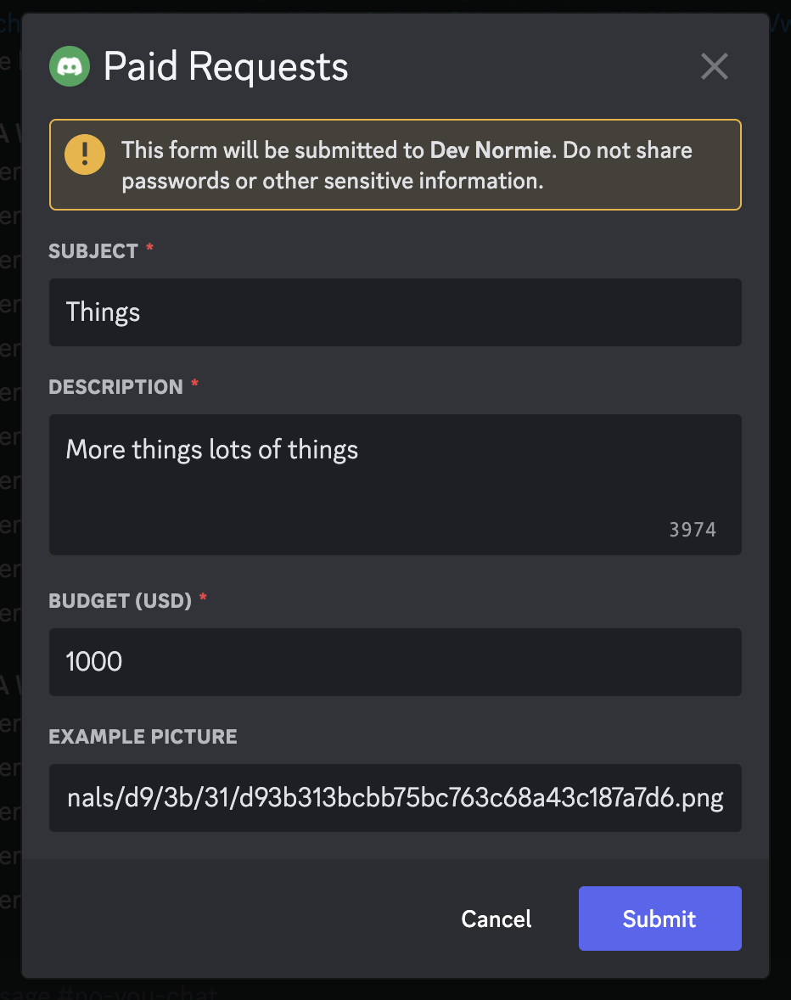
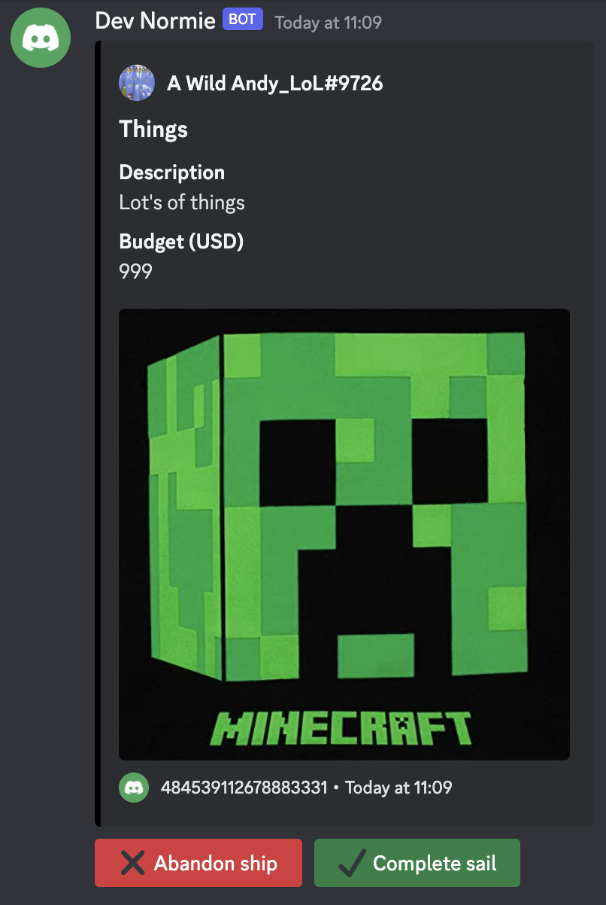
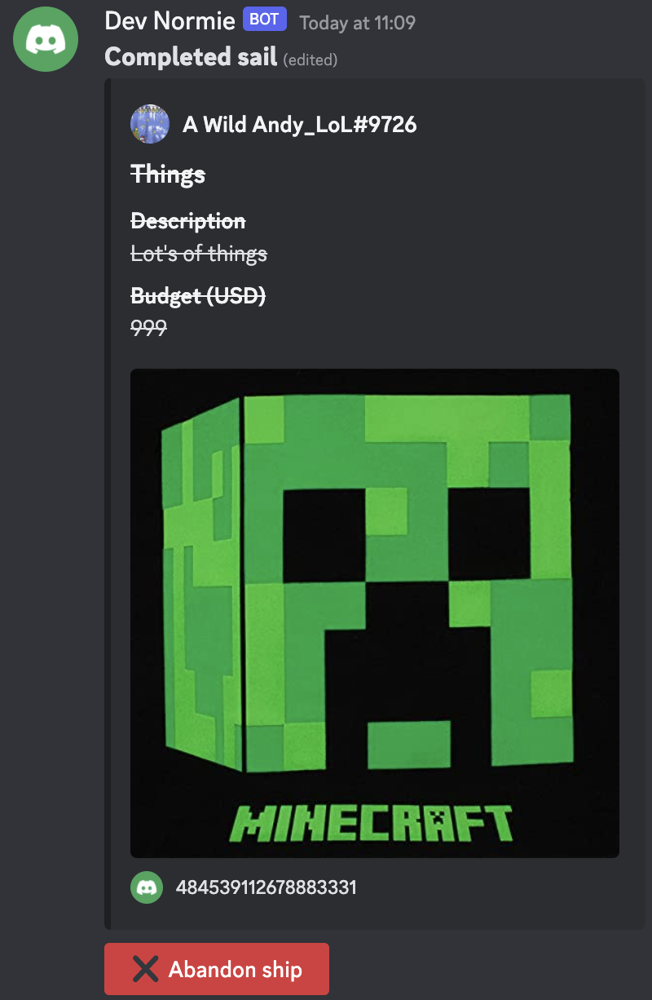

# Forms

---

When a channel id is set in a form specified in your [config](index.md), it is considered a form channel by the bot. Any messages sent by members without message manage [permission](../discord/perms.md) will be automatically deleted.

Through the `/post` command, users can post a submission to either the current channel, or the channel specified by the `target` parameter. Afterwards, a modal will popup for the user. After filling in required fields, a message will be sent, accompanied by the abandon button and, if completable, the complete button. These two button components can be used by either the user, or another user with the message manage [permission](../discord/perms.md). 


## Configuration

The following parameters are offered for forms:

- `name` - The name that will display on the top of the modal.
- `channel` - The id of the specified channel.
- `color` - The embed color of the final message.
- `completeable` - If the submission can be completable by the user.
- `fields` - See below.

Each field offers:

- `size` - The size of the text box in the modal. `(Optional & SHORT)`
  - `LONG` - A HTML `<textarea>` equivalent. 
  - `SHORT` - A short box that doesn't allow new lines.
- `isTitle` - Should the input of this field be the title of the embed message? Only one field with this true should be specified. If none is specified, the bot will default to `Submission by {DiscordUser#0000}`. (Optional)
- `name` - The name of this field.
- `min` & `max` - If `isNumber` is enabled, this will act as the number range, otherwise the letter count. Default `0` and `4000` respectively. `(Optional)`
- `inline` - Whether this field will be displayed inline or not in the final embed. `(Optional & false)`
- `isImage` - Should this field be an image url that will be set as the embed message's image? `(Optional & false)`
- `optional` - Is this field optional? `(Optional & false)`

### Example
```yaml
forms:
    - channel: 759935175060094976
      name: "Paid Requests"
      color: "#000000"
      completable: true
      fields:
          - name: Subject
            min: 2
            max: 24
            is-title: true
          - name: Description
            size: LONG
          - name: Budget (USD)
            is-number: true
            min: 1
            max: 1000
          - name: Example picture
            optional: true
            is-image: true
```

### Output
<div style="width: 100%; display: grid; grid-template-columns: 300px 300px; grid-template-rows: 1fr 1fr; gap: 30px;">
    <style>
      img {
        max-width: 300px; 
      }
    </style>
    
    
    
</div>
